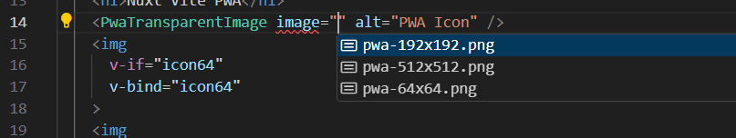
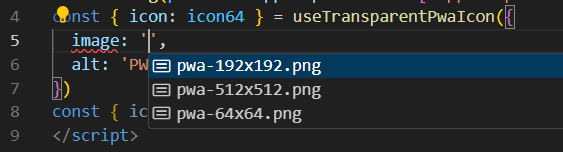
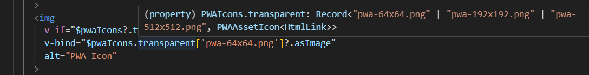

# Nuxt PWA + PWA Assets Generation

This repository is using custom `vite-plugin-pwa` local tgz dependency from [this PR](https://github.com/vite-pwa/vite-plugin-pwa/pull/621) and a custom `@vite-pwa/nuxt` local tgz. 

This example will generate PWA Assets on the fly in dev server and build:
- inject `theme-color` extracted from web manifest into `index.html`
- inject apple and apple splash icon links into `index.html`
- inject favicons links into `index.html`
- inject web manifest link into `index.html`
- inject pwa icons into the web manifest

## What's New

The new package will include:
- inlined and external configuration file for `@vite-pwa/assets-generator`
- new `NuxtPwaAssets` component: will inject all PWA assets into `index.html` and replaces `NuxtPwaManifest/VitePwaManifest`
- new components to allow you to use images (``) from PWA icons: `PwaAppleImage`, `PwaAppleSplashScreenImage`, `PwaFaviconImage`, `PwaMaskableImage` and `PwaTransparentImage`
- injects `$pwaIcons` with all confgured PWA icons: you can use it via `useNuxtApp().$pwaIcons` or inside your Vue templates
- new composables to allow you to use PWA icons: `useApplePwaIcon`, `useAppleSplashScreenPwaIcon`, `useFaviconPwaIcon`, `useMaskablePwaIcon` and `useTransparentPwaIcon`

New components, composables and `$pwaIcons` injection are statically analisable, that's, pwa icons types are generated when running `nuxt prepare` command: if you want to disable the PWA assets you don't need to remove the code (you can remove unused components/code later if you want to disable the PWA assets).

## Test

To run this repository in your local machine, you need to have `pnpm` installed. 

Then you can run the following commands in the root of the repository: 
- install dependencies: `pnpm install`
- to run dev server: `pnpm dev` (PWA disabled in dev mode: you can enable it in the nuxt config file)
- to run Nuxt `build`: `pnpm build` (PWA enabled in build mode) then `node .output/server/index.mjs`
- to run Nuxt `generate`: `pnpm generate` (PWA enabled in build mode) then `npx serve .output/public`

